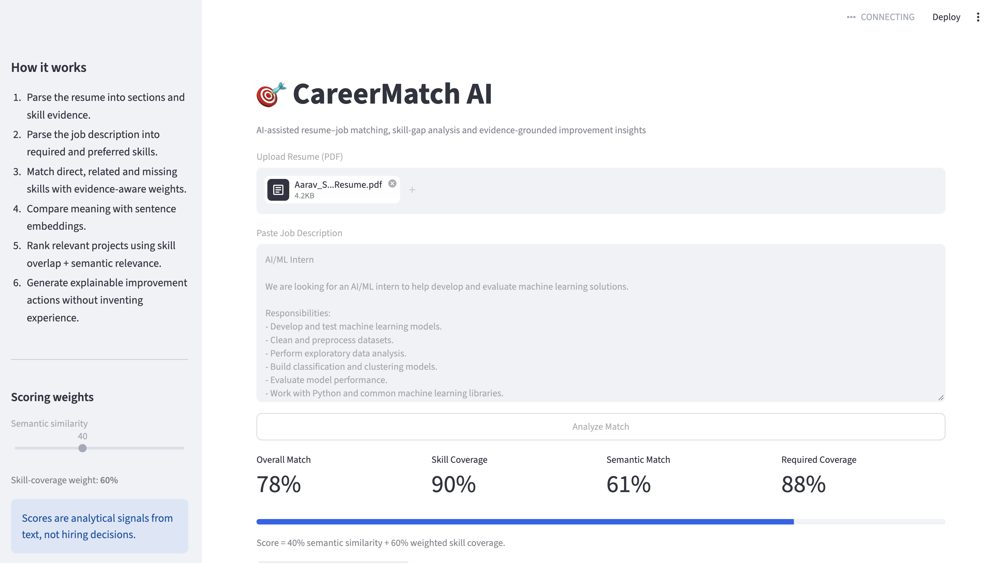
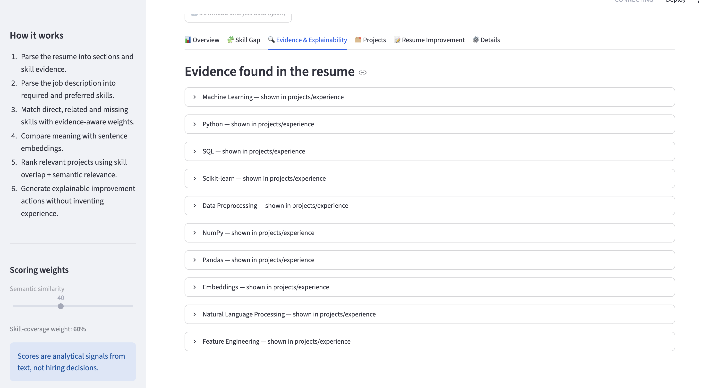
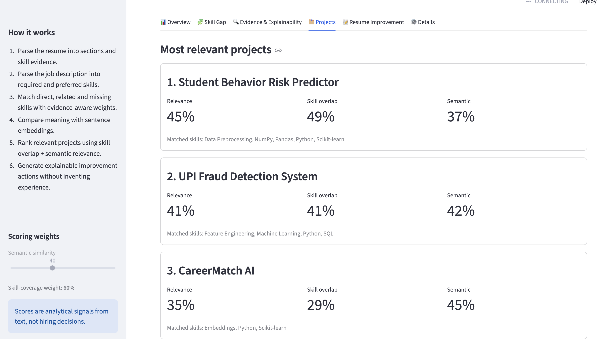
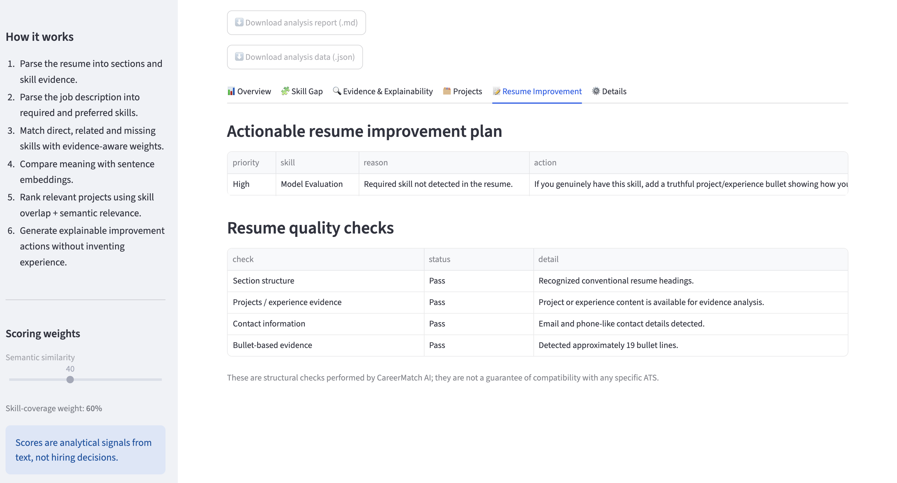
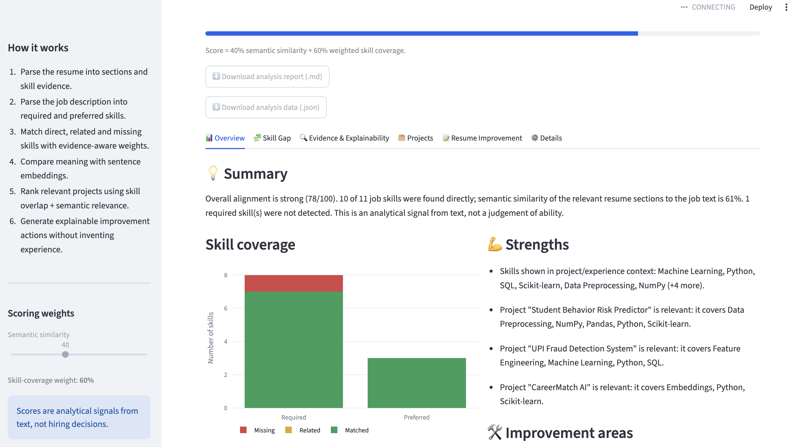

# 🎯 CareerMatch AI

Resume–job matching with section-aware parsing, weighted skill-gap analysis and an explainable report.

## What it does

1. **Resume understanding** – extracts text from a PDF, detects sections (Education, Skills, Projects, Experience, Achievements, ...), and records *how* each skill is evidenced: shown in a project/experience, only listed in a skills section, or mentioned elsewhere.
2. **Job-description understanding** – detects Responsibilities / Required / Preferred / About / Benefits sections, and classifies each skill as **required** or **preferred**, using headings when present and phrases such as "is a plus" or "nice to have" when not. Company and benefits sections are ignored.
3. **Skill-gap engine** – every job skill is *matched* (direct), *related* (e.g. PyTorch → Machine Learning, TensorFlow → PyTorch) or *missing*. Credit is weighted by requirement level, skill category and evidence strength. Each concept exists once (`NLP` and `Natural Language Processing` are one skill; `DSA` expands to Data Structures + Algorithms).
4. **Semantic match** – sentence-embedding cosine similarity (`all-MiniLM-L6-v2`) between the relevant resume sections and the job text.
5. **Project relevance** – ranks resume projects using weighted job-skill overlap plus project-vs-JD semantic similarity.
6. **Evidence explainability** – shows short resume snippets supporting detected skills and explains related-skill matches.
7. **Resume improvement plan** – prioritises missing required skills, related evidence, and skills that are only listed without project/experience context.
8. **Resume quality checks** – structural checks for headings, project/experience evidence, contact extraction and bullet-based evidence.
9. **Exportable reports** – download Markdown and JSON analysis results from the UI.

All Phase 3 explanations are deterministic and evidence-grounded; no language model is used to invent resume claims.

## Screenshots

### Dashboard


### Evidence & Explainability


### Project Ranking


### Resume Improvement


### Overview


## Architecture

```text
Resume PDF ─> pdf_parser ─> resume_parser ─┐   sections · skills · evidence · projects
                                           ├─> matcher ─> report_generator ─> Streamlit dashboard
Job description ─> jd_parser ──────────────┘      │
   sections · required/preferred skills           ├─ skill_gap  (weighted, direct/related/missing)
                                                  └─ embeddings (semantic similarity)
skill_ontology  ← single source of truth for skills, aliases, weights and relations
```

| Module | Role |
|---|---|
| `src/skill_ontology.py` | Canonical skills, aliases, categories/weights, `IMPLIES` and sibling relations |
| `src/skill_extractor.py` | Boundary-aware alias matching (handles `C` vs `C++`, `Node.js` vs `js`, URLs) |
| `src/sections.py` | Resume/JD heading detection, project/experience entry splitting |
| `src/resume_parser.py`, `src/jd_parser.py` | Structured resume and JD |
| `src/skill_gap.py` | Weighted gap analysis |
| `src/matcher.py`, `src/pipeline.py` | Hybrid score and end-to-end entry point |
| `src/report_generator.py` | Strengths / improvements / summary |

## Scoring

```
Skill coverage = Σ(weight × credit) / Σ(weight) over job skills
  weight = (1.0 required | 0.5 preferred) × category importance
  credit = 1.0 shown in projects/experience · 0.8 in skills list only · 0.7 mentioned elsewhere
           0.5 related skill · 0.0 missing

Overall = 0.4 × semantic similarity + 0.6 × skill coverage
```

These weights are design choices, not tuned optima. Raw embedding cosine scores for resume/JD pairs fall in a narrow band, so explicit skill coverage gets the larger share. If no vocabulary skill is found in the JD, the score falls back to semantic similarity alone and the UI says so.

## Run locally

```bash
python3 -m venv venv && source venv/bin/activate
pip install -r requirements.txt
streamlit run app.py
```

The first run downloads the Sentence Transformer model.

## Tests and evaluation

```bash
pytest                          # unit tests; no model download needed
python -m evaluation.evaluate   # extraction accuracy on the labelled set, writes evaluation/RESULTS.md
```

`evaluation/dataset.py` holds 5 hand-labelled synthetic resume/JD pairs covering a sectioned resume, a headingless resume, PDF-style bullets, an unrelated resume and an implicit-skill resume. Latest results are in [`evaluation/RESULTS.md`](evaluation/RESULTS.md).

**Read these numbers with care.** The set is tiny and written by the same person who wrote the extractor, so it measures regressions and known edge cases, not real-world accuracy. Skill precision/recall is measured only against this project's vocabulary. A proper evaluation needs real, anonymised resumes labelled by more than one person. The one miss it currently shows is intended: "trained a model ... using scikit-learn" does not literally say "machine learning", so the extractor does not report it (the gap engine still gives related credit through scikit-learn).

## Limitations

- Skills are found by vocabulary and aliases. Anything outside `skill_ontology.py` is invisible, and skills described without naming them ("trained a classifier") are missed.
- Heading detection needs conventional headings. Unusual layouts, multi-column PDFs and scanned PDFs (no OCR) degrade results; when no headings are found the app warns and skips evidence weighting.
- Project splitting is heuristic and can be fooled by wrapped PDF lines.
- Required/preferred classification is cue-based English phrase matching.
- Relations in the ontology (what counts as "related") are hand-authored judgements.
- Semantic similarity is not qualification, and the score must not be used as an automated hiring decision. Resume claims are not verified.

## Roadmap

- OCR for scanned resumes
- Larger real-data evaluation with multiple annotators
- Experience-duration and education extraction
- Optional LLM-written explanation, checked against the computed evidence
- Configurable scoring weights in the UI
